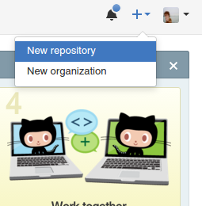
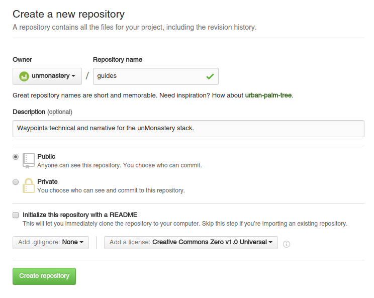

## Workflow Guide for Git

This document aims to provide an easy to follow workflow for uploading documents and collaborating on Github. While Github offers a wide range of [help tutorials](https://guides.github.com/activities/hello-world/) and searching error messages usually yields answers on forums like [Stack Overflow](http://stackoverflow.com), this guide details one example of workflow and habits while using Git. 

At certain steps in the process, this guide assumes a basic familarity with Github terminology. Please see the [Github Glossary](https://help.github.com/articles/github-glossary/) for more in-depth discussions of the terms in use.

1. Register an account on [Github.com](http://github.com).

1. Install Github software on your computer. Tutorial [here](https://git-scm.com/book/en/v2/Getting-Started-Installing-Git).

##### This guide uses this repository as a workspace for editing. Alternatively, if you already have a project repository (which is like the equivalent of a folder on your ownCloud or Google Drive), begin here. If not, please continue on to the next header section.

1. Log into Github.com and click on the + icon in the upper right corner to create a new repository.

2. Choose the repository name (and organisation if applicable).

3. Enter a description (optional).

4. Choose an open source license from the list provided. For text content, I'd recommend CC0, and for software, GNUv3.

### Git Workflow for Document Editing

#### Create a local Git repository on your computer

1. Create a folder named 'development' in your computer's home directory.

2. If using a UNIX-based operating system (Mac or Linux) open the [Terminal](https://en.wikipedia.org/wiki/Terminal_emulator) application. Enter this line of text:

    `cd development`

	This line brings you to the the 'development' folder in Terminal. It is the text-based equivalent of clicking on the development folder and then having access to all of the files the folder contains.

3. In Terminal, enter this line of text:

    `git clone https://github.com/unmonastery/guides`

	This copies the existing files in the online Git repository to your development folder, in its own folder called 'guides'. You now have access to the files [locally](http://www.webopedia.com/TERM/L/local.html).

#### Editing and saving files locally

4. Open your favorite [plain-text editor](http://lifehacker.com/five-best-text-editors-1564907215), and navigate to the 'guides' folder you just created. Open the file named workspace.md.

5. Make any text changes you want to this file! Just remember that whatever you write will go online. ;)

6. Return to the Terminal application, and enter this line:

    `git status`

	Terminal will likely return a message that reads something like `modified:   github_workflow.md`. In Git terminology, this means changes are ready to be staged for a commit. As a rough analogy, you can think of what happens when you choose 'Save As' to overwrite a text file. The prompt asking 'Are you sure you want to do this?' is similar to staging a file in Git, and clicking 'Yes' is analogous to commiting a file.

7. To stage all files, enter:
 
    `git add .`

8. To commit all staged files:

    `git commit -am 'Commit message here'`

	When you commit a file in Git, it's useful to include a descriptive message of the changes you've made, e.g. 'Updated intro text'. This will be visible to other users of the repository and help collaboration.

9. You've now saved the files on your computer by committing them, which saves a unique log point in their progress. (If you're familiar with using the Revision History function of Google Docs, you can think of this save point as being able to *choose* when specific versions of the file is logged and thus able to be restored.) 

#### Saving files online in the collaborative Git repository

10. Save a copy of the files on the hosted (online) Git repository by 'pushing' your changes. Note: this will only save changes from the last time you committed files.

	`git push origin master`

11. You will be prompted for your username and password. After this process is finished, go to [https://github.com/unmonastery/guides/blob/master/workspace.md](https://github.com/unmonastery/guides/blob/master/workspace.md) and view your changes online.

------------------------

#### Future scope

*  Techniques for merging and reverting
*  Explain branches
*  Collaboration best practices
*  Explain remote respositories (origin, target)
*  Techniques for merging and reverting
