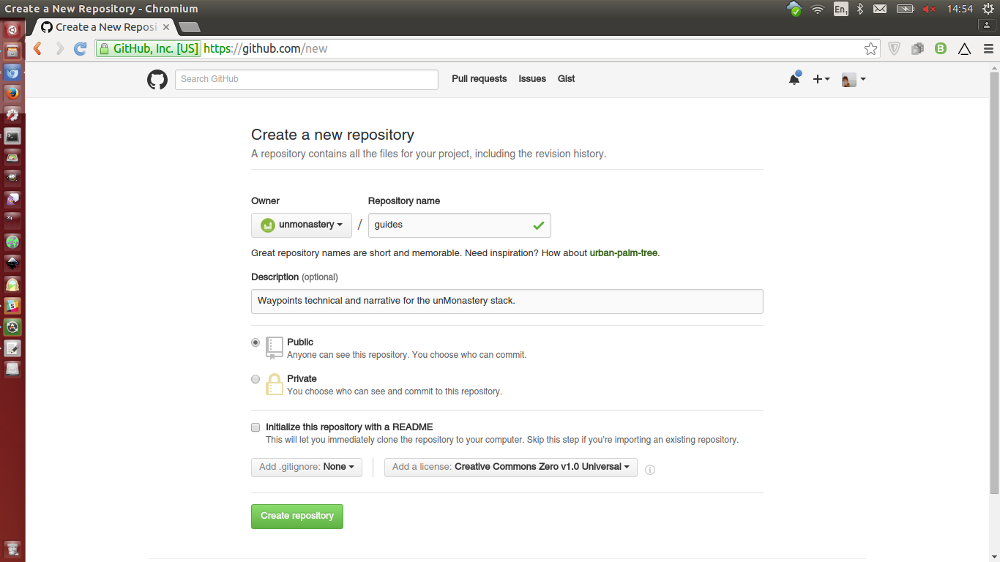

### Workflow Guide for Git

This document aims to provide an easy to follow workflow for uploading documents and collaborating on Github. While Github offers a wide range of [help tutorials](https://guides.github.com/activities/hello-world/) and searching error messages usually yields answers on forums like [Stack Overflow](http://stackoverflow.com), this guide details one example of workflow and habits while using Git.

1. Register an account on [Github.com](http://github.com).

1. Install Github software on your computer. Tutorial [here](https://git-scm.com/book/en/v2/Getting-Started-Installing-Git).

#### If your project does not have an existing Git repository (which is like the equivalent of a folder on your ownCloud or Google Drive), begin here. If you want to work from an existing repository, skip to the next section.

1. Log into Github.com and click on the + icon in the upper right corner to create a new repository.

1. a) choose name
	a1) choose org
	b) description optional
	c) choose open source license

1. If using a UNIX-based operating system (Mac or Linux) open the [Terminal](link) application. Enter this line of text:

git clone https://github.com/unmonastery/guides

open this file in the directory

make changes

git status

git add .

git commit -am 'Commit messages'

git remote -v

origin	https://github.com/unmonastery/guides (fetch)
origin	https://github.com/unmonastery/guides (push)

git push origin master

[call git program] [save to online version of files] [save to "origin" of online files] [which branch]