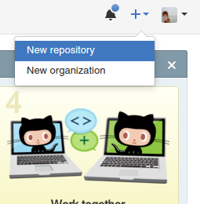
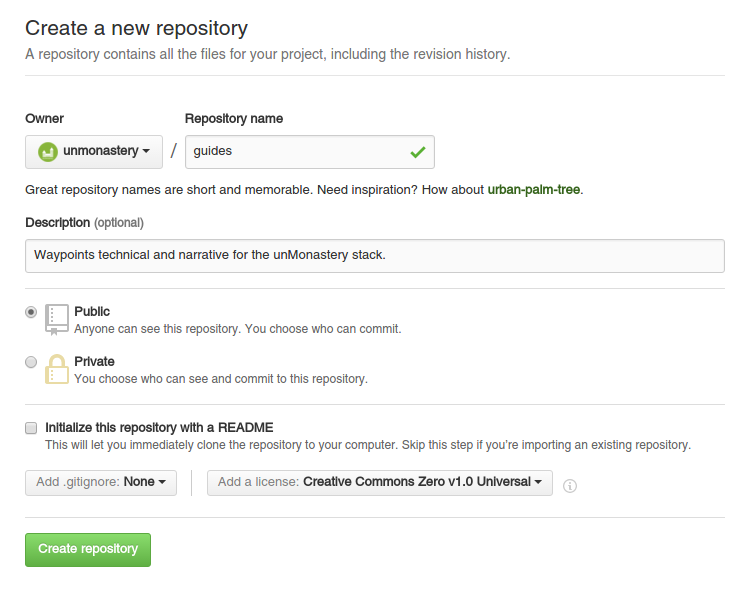

### Workflow Guide for Git

This document aims to provide an easy to follow workflow for uploading documents and collaborating on Github. While Github offers a wide range of [help tutorials](https://guides.github.com/activities/hello-world/) and searching error messages usually yields answers on forums like [Stack Overflow](http://stackoverflow.com), this guide details one example of workflow and habits while using Git.

1. Register an account on [Github.com](http://github.com).

1. Install Github software on your computer. Tutorial [here](https://git-scm.com/book/en/v2/Getting-Started-Installing-Git).

#### This guide uses this repository as a workspace for editing. Alternatively, if you already know what project repository (which is like the equivalent of a folder on your ownCloud or Google Drive), you'd like to work from begin here. If not, please continue on to the next header section.

1. Log into Github.com and click on the + icon in the upper right corner to create a new repository.

1. Choose the repository name (and organisation if applicable).

1. Enter a description (optional).

1. Choose an open source license from the list provided. For text content, I'd recommend CC0, and for software, GNUv3.

#### The following steps will copy the online repository of files to your computer.

1. Create a folder named 'development' in your computer's home directory.

1. If using a UNIX-based operating system (Mac or Linux) open the [Terminal](link) application. Enter this line of text:

    cd development

This line brings you to the the 'development' folder in Terminal. It is the text-based equivalent of clicking on the development folder and then having access to all of the files the folder contains.

1. In Terminal, enter this line of text:

    git clone https://github.com/unmonastery/guides

This copies the existing files in the online Git repository to your development folder, in its own folder called 'guides'. You now have access to the files [locally](http://www.webopedia.com/TERM/L/local.html).

2. Open your favorite [plain-text editor](http://lifehacker.com/five-best-text-editors-1564907215), and navigate to the 'guides' folder you just created. Open the file named workspace.md.

1. Make any text changes you want to this file! Just remember that whatever you write will go online. ;)

1. Return to the Terminal application, and enter this line:

    git status

Terminal will likely return a message that reads something like `modified:   github_workflow.md`.

    git add .

    git commit -am 'Commit messages'

    git remote -v

origin	https://github.com/unmonastery/guides (fetch)
origin	https://github.com/unmonastery/guides (push)

git push origin master

[call git program] [save to online version of files] [save to "origin" of online files] [which branch]